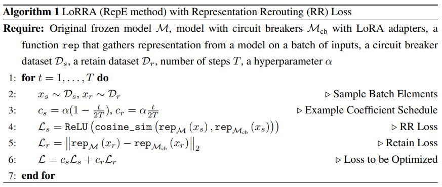
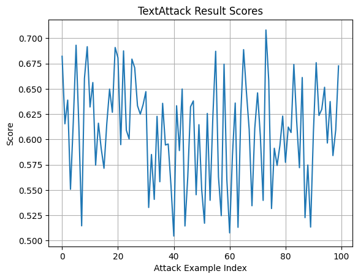
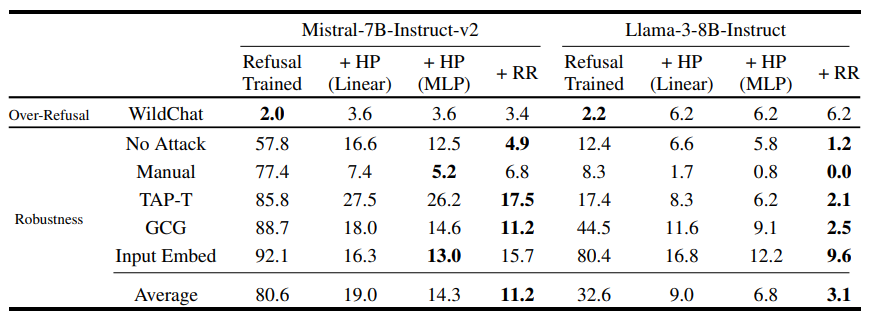

# Circuit Breakers
**Contributors: [ [Md. Fahad Hossion](https://github.com/ks-fahad) ] [ [Anser Bape]() ]    || [Document](https://gamma.app/docs/Circuit-Breakers-An-Approach-to-AI-Safety-ccdt0dyt96mbzml?mode=doc) ||**

## Overview

The proposed approach, first introduced in paper [Improving Alignment and Robustness with Circuit Breakers](https://arxiv.org/pdf/2406.04313), presents a novel method to enhance the safety of models by preventing the generation of harmful outputs. Unlike traditional methods that focus on removing vulnerabilities through adversarial training or input filters, this approach aims to stop harmful outputs before they are produced.

This is achieved through the use of <b>circuit breakers</b> which interrupt a model's internal processes when it begins to generate harmful content. The method utilizes representation engineering (RepE) to link representations associated with harmful outputs to these circuit breakers, effectively halting the harmful generation process.


---

## Table of Contents

- [Overview](#overview)
- [Introduction](#introduction)
- [Methodology](#methodology)
- [Results Analysis](#results-analysis)
- [Discussion and Conclusion](#discussion-and-conclusion)
- [Installation](#installation)
- [Contributing](https://github.com/ks-fahad/CircuitBreakers/graphs/contributors)
- [License](https://github.com/ks-fahad/CircuitBreakers/blob/main/LICENSE)

---

## Introduction

The introduction of circuit-breaking presents a new strategy for building highly reliable safeguards. Traditional techniques, such as Reinforcement Learning with Human Feedback (RLHF) and adversarial training, provide output-level supervision that leads to refusal states within the model's representation space. However, harmful states can still be reached once these refusal states are bypassed. In contrast, drawing inspiration from representation engineering, circuit-breaking targets internal representations directly by connecting harmful states to "circuit breakers." This effectively prevents the model from progressing through sequences of harmful states.

---

## Methodology



---

## Results Analysis

<p align="center">
    
   
</p>
<!--   -->

---

## Discussion and Conclusion

The approach presented focuses on defending against a specific type of adversarial attack: those targeting a model’s ability to produce harmful content, particularly content that goes against the model developer's intentions. It does not address "traditional" adversarial attacks aimed at altering class labels, as no class label is inherently harmful in such cases. The method specifically targets attacks intended to generate harmful information. Circuit-breaking, based on Representation Engineering (RepE), significantly enhances model robustness by making models safer and more resistant to unseen adversarial threats. It is a versatile approach that can safeguard against image hijacks and prevent AI agents from taking harmful actions, representing a major step toward more aligned and robust models.

---


## Installation

Follow the steps below to install and set up the project.

### Prerequisites

- **Python**: Ensure you have the appropriate runtime installed.
- **pip**: Package manager for Python.

### Installation Steps

1. Clone the repository:
   ```bash
   git clone https://github.com/ks-fahad/CircuitBreakers.git
   cd CircuitBreakers
   
2. Install the dependencies:
   ```bash
   pip install -r requirements.txt
   
3. Execute the Shell Script:
   ```bash
   ./scripts/lorra_circuit_breaker_gpt2.sh
   ./scripts/lorra_circuit_breaker_llama3_8b.sh
   ./scripts/lorra_circuit_breaker_mistral_7b.sh
   
